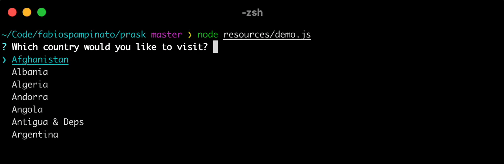

# Prask

Lightweight prompting library for terminal apps.

## Install

```sh
npm install --save prask
```

## Prompts

| Input                   | Selection                   | Others              |
| ----------------------- | --------------------------- | ------------------- |
| [string](#string)       | [multiselect](#multiselect) | [prompt](#prompt)   |
| [invisible](#invisible) | [select](#select)           | [spinner](#spinner) |
| [password](#password)   | [boolean](#boolean)         |                     |
| [number](#number)       | [toggle](#toggle)           |                     |
|                         | [rating](#rating)           |                     |

### `string`

<p align="center">
  
</p>

This prompt can be used to ask the user for a string value.

```ts
import {string} from 'prask';

const result = await string ({
  /* REQUIRED OPTIONS */
  message: 'What is your name?', // The message that the user will read
  /* OPTIONAL OPTIONS */
  initial: 'John Doe', // Optional default value, to allow the user to quickly press Enter for it
  validate: value => value.length >= 2 // Optional validation function
});
```

Interactions:

| Trigger | Description                                                                      |
| ------- | -------------------------------------------------------------------------------- |
| `Esc`   | Quit the prompt, which will resolve to `undefined`.                              |
| `Enter` | Submit the value, or the initial value if visible, checking if it's valid first. |
| `Tab`   | Edit the initial value, if visible.                                              |

### `invisible`

<p align="center">
  
</p>

This prompt can be used to ask the user for a password, without visually leaking even the length of the password to the console.

```ts
import {invisible} from 'prask';

const result = await invisible ({
  /* REQUIRED OPTIONS */
  message: 'What is your password?', // The message that the user will read
  /* OPTIONAL OPTIONS */
  initial: 'P@assword!', // Optional default value, to allow the user to quickly press Enter for it, better not to use it since it will be visible
  validate: value => value.length >= 8 // Optional validation function
});
```

It can be interacted with exactly like a `string` prompt, the only difference is that the value is invisible.

### `password`

<p align="center">
  
</p>

This prompt can be used to ask the user for a password, without visually leaking the characters that make it up to the console.

```ts
import {password} from 'prask';

const result = await password ({
  /* REQUIRED OPTIONS */
  message: 'What is your password?', // The message that the user will read
  /* OPTIONAL OPTIONS */
  initial: 'P@assword!', // Optional default value, to allow the user to quickly press Enter for it, better not to use it since it will be visible
  validate: value => value.length >= 8 // Optional validation function
});
```

It can be interacted with exactly like a `string` prompt, the only difference is that every character in the value will be replaced with an asterisk.

### `number`

<p align="center">
  
</p>

This prompt can be used to ask the user for a numeric value.

```ts
import {number} from 'prask';

const result = await number ({
  /* REQUIRED OPTIONS */
  message: 'What is your favorite even number?', // The message that the user will read
  /* OPTIONAL OPTIONS */
  initial: 42, // Optional default value, to allow the user to quickly press Enter for it
  validate: value => ( value % 2 ) ? 'The number must be even' : true // Optional validation function
});
```

It can be interacted with exactly like a `string` prompt, the only difference is that the value of the input is also automatically validated to be a number.

### `multiselect`

<p align="center">
  
</p>

This prompt can be used to ask the user to pick from zero to many options between the provided ones.

```ts
import {multiselect} from 'prask';

const result = await multiselect ({
  /* REQUIRED OPTIONS */
  message: 'Which countries would you like to visit?', // The message that the user will read
  options: [
    { title: 'Italy', value: 'it' },
    { title: 'Turkey', value: 'tr' },
    { title: 'United Kingdom', value: 'uk' }
  ],
  /* OPTIONAL OPTIONS */
  limit: 10, // Limit to this number the maximum number of options visible at one time
  min: 1, // Require at least this number of options to be selected
  max: 10, // Require at most this number of options to be selected
  searchable: false, // Turn off support for filtering the list of options
  validate: values => ( values.length % 2 ) // Optional validation function
});
```

Each option must have the following shape:

```ts
type Option<T> = {
  /* REQUIRED VALUES */
  title: string, // The name of the option that will be showed to the user
  value: T, // The value of the option that the prompt will return you when this option is selected
  /* OPTIONAL VALUES */
  disabled?: boolean, // Whether this option can be changed or not
  description?: string, // The description that will be showed next to the title
  heading?: boolean, // Whether this option is an unselectable heading or not
  hint?: string, // The description that will be showed next to the title, only when the item is focused
  selected?: boolean // Whether this option is pre-selected or not
};
```

Interactions:

| Trigger | Description                                                                            |
| ------- | -------------------------------------------------------------------------------------- |
| `Esc`   | Quit the prompt, which will resolve to `undefined`.                                    |
| `Enter` | Submit the selected values, checking if the selection is valid first.                  |
| `Space` | Toggle the focused option.                                                             |
| `Up`    | Move the focus to the previous item, and potentially scroll to the previous page.      |
| `Down`  | Move the focus to the next item, and potentially scroll to the next page.              |
| `*`     | All other keys will be used to edit the search query, which will filter down the list. |

### `select`

<p align="center">
  
</p>

This prompt can be used to ask the user to pick one option between the provided ones.

```ts
import {select} from 'prask';

const result = await select ({
  /* REQUIRED OPTIONS */
  message: 'Which country would you like to visit first?', // The message that the user will read
  options: [
    { title: 'Italy', value: 'it' },
    { title: 'Turkey', value: 'tr' },
    { title: 'United Kingdom', value: 'uk' }
  ],
  /* OPTIONAL OPTIONS */
  limit: 10, // Limit to this number the maximum number of options visible at one time
  searchable: false, // Turn off support for filtering the list of options
  validate: value => value !== 'Foo' // Optional validation function
});
```

It can be interacted with exactly like a `multiselect` prompt.

### `boolean`

<p align="center">
  
</p>

This prompt can be used to ask the user to pick between yes and no.

```ts
import {boolean} from 'prask';

const result = await boolean ({
  /* REQUIRED OPTIONS */
  message: 'Do you like this library?', // The message that the user will read
  /* OPTIONAL OPTIONS */
  initial: true // Select this option by default
});
```

It can be interacted with exactly like a `select` prompt, except that search is turned off for it.

### `toggle`

<p align="center">
  
</p>

This prompt can be used to ask the user to pick between yes and no, using a single line of output, rather than the three that `boolean` needs.

```ts
import {toggle} from 'prask';

const result = await toggle ({
  /* REQUIRED OPTIONS */
  message: 'Do you like this library?', // The message that the user will read
  /* OPTIONAL OPTIONS */
  initial: true // Select this option by default
});
```

Interactions:

| Trigger              | Description                                         |
| -------------------- | --------------------------------------------------- |
| `Esc`                | Quit the prompt, which will resolve to `undefined`. |
| `Enter`              | Submit the selected option.                         |
| `Left`/`Right`/`Tab` | Select the other option.                            |

### `rating`

<p align="center">
  
</p>

This prompt can be used to ask the user for a numeric rating between 1 and 5.

```ts
import {rating} from 'prask';

const result = await rating ({
  /* REQUIRED OPTIONS */
  message: 'How would you rate this library?', // The message that the user will read
  /* OPTIONAL OPTIONS */
  initial: 5 // Select this option by default
});
```

Interactions:

| Trigger       | Description                                         |
| ------------- | --------------------------------------------------- |
| `Esc`         | Quit the prompt, which will resolve to `undefined`. |
| `Enter`       | Submit the selected rating.                         |
| `Right`/`Up`  | Increment the selected rating.                      |
| `Left`/`Down` | Decrement the selected rating.                      |

### `prompt`

This is a low-level general prompt, which is used internally to implement the other higher-level prompts, and which you can use to implement your own custom prompts.

```ts
import {prompt} from 'prask';
import color from 'tiny-colors';

// Let's define the "rating" prompt, it returns a number between 1 and 5, which is the rating the user picked
// This is the actual internal implementation for that component, so you can see exactly how it works

type Rating = 1 | 2 | 3 | 4 | 5;

type Options = {
  message: string,
  initial?: Rating
};

// A prompt could always resolve to "undefined", if the user escapes from it
const rating = ( options: Options ): Promise<Rating | undefined> => {

  // Let's define some internal constants we need for rendering

  const STAR_ACTIVE = color.green ( '●' );
  const STAR_INACTIVE = '○';
  const STARS_DIVIDER = '-----';
  const LABELS_DIVIDER = '     ';

  // Let's define some internal state variables
  // The status variable let's us keep track of whether this prompt was escaped (-1), submitted (1), or it's still pending (0)

  let {message, initial = 2} = options;
  let status: -1 | 0 | 1 = 0;
  let current = initial;

  // Let's define some components
  // Basically each prompt re-renders its components in a loop, React-style
  // Each prompt must return something to render, which can be a single component or an array of components
  // A component is just a function that can either return a string, which will be printed to the console, or undefined, which will be ignored
  // The "prompt" function takes care of cleaning up the previous output and replacing it with the new one
  // That's basically how the entire library works, the "prompt" function tells you when a key is pressed, and you just tell it what to render next

  const statusSymbol = ( status ): string => {
    if ( status < 0 ) return color.red ( '✖' );
    if ( status > 0 ) return color.green ( '✔' );
    return color.cyan ( color.bold ( '?' ) );
  };

  const question = (): string => {
    const question = `${statusSymbol ()} ${color.bold ( message )}`;
    const result = status === 1 ? color.cyan ( String ( current ) ) : '';
    return [question, result].join ( ' ' );
  };

  const stars = (): string => {
    const star1 = ( current === 1 ) ? STAR_ACTIVE : STAR_INACTIVE;
    const star2 = ( current === 2 ) ? STAR_ACTIVE : STAR_INACTIVE;
    const star3 = ( current === 3 ) ? STAR_ACTIVE : STAR_INACTIVE;
    const star4 = ( current === 4 ) ? STAR_ACTIVE : STAR_INACTIVE;
    const star5 = ( current === 5 ) ? STAR_ACTIVE : STAR_INACTIVE;
    const stars = [star1, star2, star3, star4, star5].join ( STARS_DIVIDER );
    return stars;
  };

  const labels = (): string => {
    return [1, 2, 3, 4, 5].join ( LABELS_DIVIDER );
  };

  // Now let's handle keypresses

  return prompt ( ( resolve, key ) => {
    if ( key === '' ) { // Initial render, no key has been pressed yet
      return [question, stars, labels];
    } else if ( key === '\x1B' ) { // Escape, let's bail out
      status = -1;
      resolve ( undefined );
      return [question];
    } else if ( key === '\r' ) { // Enter, let's return the current rating
      status = 1;
      resolve ( current );
      return [question];
    } else if ( key === '\x1B[D' || key === '\x1B[B' ) { // Left or Down, let's decrement the rating, if possible
      current = Math.max ( 1, current - 1 );
      return [question, stars, labels];
    } else if ( key === '\x1B[C' || key === '\x1B[A' ) { // Right or Up, let's increment the rating, if possible
      current = Math.min ( 5, current + 1 );
      return [question, stars, labels];
    } else { // Something else was pressed, let's just ignore it
      return [question, stars, labels];
    }
  });

};
```

### `spinner`

<p align="center">
  
</p>

The spinner prompt is a convenience wrapper around [`tiny-spinner`](https://github.com/fabiospampinato/tiny-spinner), which you could also use directly if you prefer.

It allows to notify the user of in progress operations, and can resolve to a successful or an unsuccessful state.

```ts
import {spinner} from 'prompts';

const result = await spinner ( async ({ update, resolve, reject }) => {
  update ( 'Working' );
  await delay ( 750 );
  update ( 'Working hard' );
  await delay ( 750 );
  update ( 'Working harder' );
  await delay ( 750 );
  update ( 'Working real hard' );
  await delay ( 750 );
  let result = true; // Let's say this is the result of the operation
  if ( result ) {
    resolve ( 'Work succeeded' );
  } else {
    reject ( 'Work failed' );
  }
});
```

## License

MIT © Fabio Spampinato
